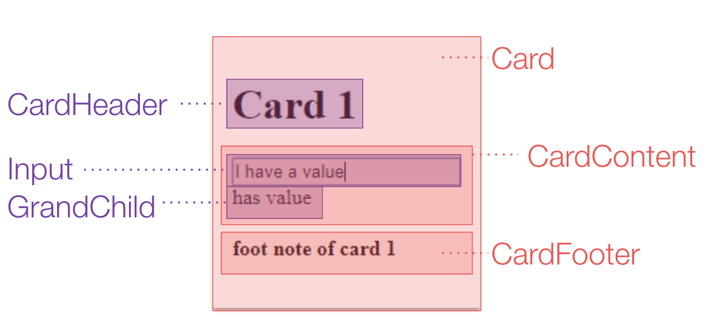

# Good Card / Bad Card

## About
This repo demonstrate how small changes in react code can have tremendous effect
on the app.

## How to use this repository
* Go over the [description](#show-case-app-description) of the show case app
* Open your **dev tools** and check out the **bad** card example [here](https://ofirdagan.github.io/good-card-bad-card/dist/bad-card/)
* Open your **dev tools** and check out the **good** card example [here](https://ofirdagan.github.io/good-card-bad-card/dist/good-card/)
* Look at the bad cop [code](src/client/bad-card.js)
* Look at the good cop [code](src/client/good-card.js)
* Read about the [differences](#differences-between-the-good-card-and-the-bad-card) and why do they matter

## Show case app description
The app consists of an array of 100 cards (nothing crazy). The card's components layout shown below.
At the top of the app there's a counter for the number of cards who have some text in their
input field.



## Differences between the good card and the bad card

It all boils down to one line and one line **only**, and that line is:

```javascript
//bad-card.js#30
handleChange={({index, text}) => this.handleChange({index, text})}

//vs
//good-card.js#31
handleChange={this.handleChange}
```
**Why?**

when any of the input changes we call the `root component`. This is a common pattern. We have one component who monitor
and manage data from several `children component`. However in our case, every time `handleChange` is called we set the new value
of the card, calculate the total number of cards with values and then call `setState` with the new values.

In `good-card` the call to `setState` doesn't really matter. Only the `value` property of the card that its value was changed is changed
and so it triggers a re-render for that card only.

In `bad-card` however on every call to `handleChange` we build the card array again but this time each card has a new `handleChange` reference
because we used an anonymous function. 

***Note:***

It doesn't matter that `Card` is a `PureComponent`. It still get a new prop `handleChange` reference which is different than
the previous `handleChange` reference.

### How to run this code locally

* `npm install`
* in one terminal `npm run watch`
* in another one `npm run start`
* open `http://localhost:3000/good/` and `http://localhost:3000/bad/`  
